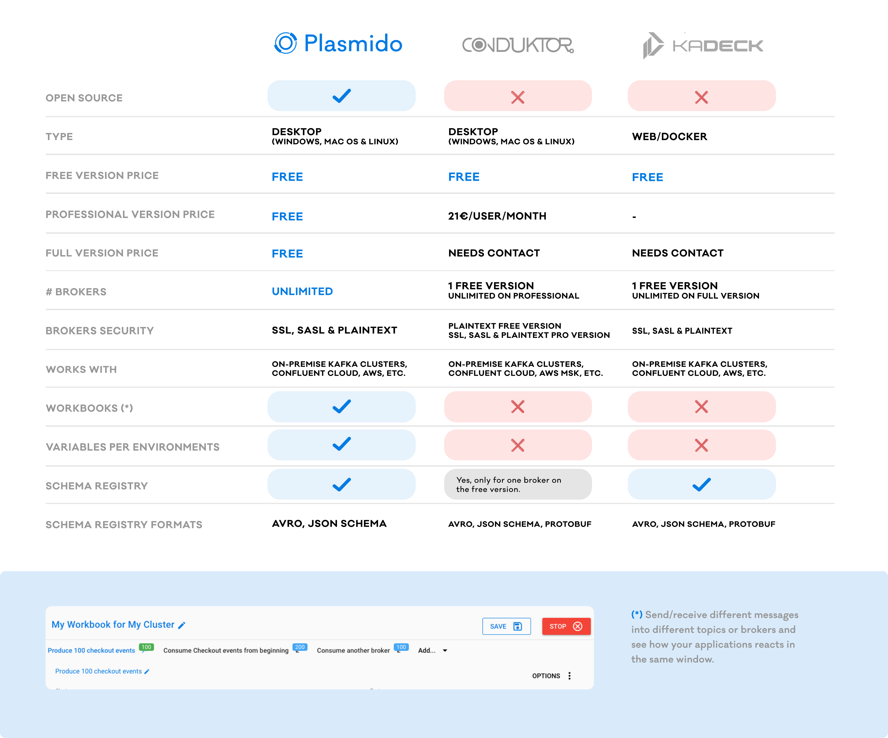
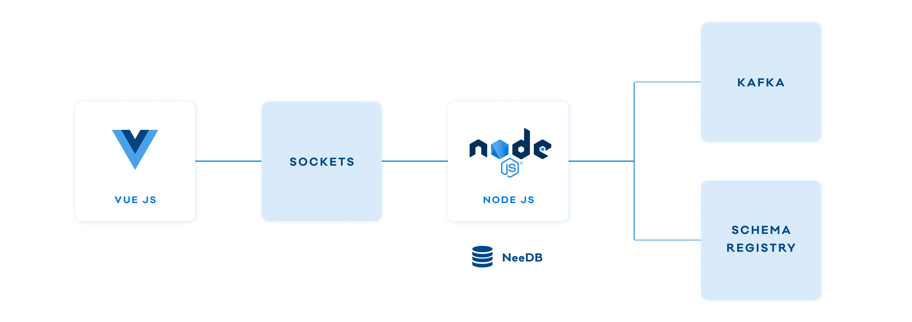

= Plasmido
Gonzalo García Jaubert <gonzalo@theagilemonkeys.com>
:icons: font
ifdef::env-github[]
:tip-caption: :bulb:
:note-caption: :information_source:
:important-caption: :heavy_exclamation_mark:
:caution-caption: :fire:
:warning-caption: :warning:
endif::[]
:toc:
:toc-placement!:
:notitle:

image::doc/images/Intro.png[]
image::doc/images/Intro%202.png[]

== Releases

* Version 0.1.0:
** Mac version: https://github.com/theam/plasmido/releases/download/v0.1.0/plasmido-darwin-v0.1.0.zip

== Development

*Plasmido* is an Electron application that runs on your computer. You can run it from sources or build an executable for your preferred platform.

=== Installation

. Install dependencies: `npm install`

NOTE: Node.js >=12.22.1 is required

. Install quasar cli: `https://quasar.dev/quasar-cli/installation`

[source,shell script]
----
$ yarn global add @quasar/cli
# or
$ npm install -g @quasar/cli
----

=== Run

Start application: `npm run electron-dev`

=== Generate executable

To build an executable, simply run `npm run build`

To build executables for all platforms (Mac, Linux and Windows), run `npm run build-all`

The executable will be generated on the `dist` folder. Double-click on the executable file to start it.

== Getting Started

Check https://github.com/theam/plasmido/wiki/Getting-Started[Getting Started Wiki]

image::doc/images/Pic%201.png[]

== Motivation

*Plasmido* was created as an internal tools to help us test our Kafka events in an easy way. We believe that more people may find it useful and benefit from it, so we want to share it with the community.

== Comparison

== Contribute

Currently, *Plasmido* is in an early stage of development, but it has reached a level where it is usable and stable enough, despite not having all the desired features and needing stability, UX/UI, etc… improvements.

Pull requests are welcome. For major changes, please open an issue first to discuss what you would like to change.

=== Resources

. Plasmido is an Electron applications built with:
.. https://v3.vuejs.org/[VueJS]
.. https://quasar.dev/introduction-to-quasar[Quasar]
.. https://kafka.js.org/[KafkaJS]
.. https://kafkajs.github.io/confluent-schema-registry/[Confluent Schema Registry]
.. and many other open source projects...!

== Disclaimer
*Plasmido* is under development, and non-backward-compatible changes might be introduced. Currently, *Plasmido* does not encrypt communications, credentials or any sensitive information, nor does it protect against unwanted access to information.

== Credits

https://www.theagilemonkeys.com/[The Agile Monkeys]

== License

*Plasmido* is licensed under the Apache License, Version 2.0. See the link:[LICENSE] file for more details.
